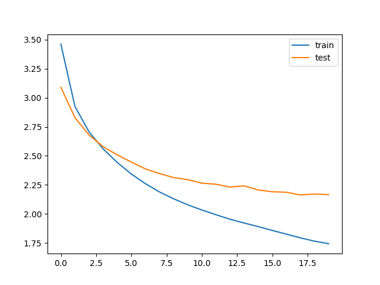

# Language Technology Project | University of Groningen

In this project we compare three summarization models on the WikiHow dataset.

Each of the model is uses a different embedding to encode the sentences. The results are compared and presented in the report.

Embeddings used are

- Word2Vec
- GloVe
- BERT

## Word2Vec

---

See word2vect_README.pdf for word2vec model

## GloVe

---

See GloVeReadMe.txt for GloVe model

## BERT

---

The `bert_encoder_embedding.py` file contains the code to train and test the model. The outputs generated are stored in `without_stopwords_output.txt`. `attention.py` file was obtained from the (https://github.com/thushv89/attention_keras/blob/master/src/layers/attention.py) as keras does not have an inbuilt attention layer.

## Sample Outputs

---

```
Original summary: how to stop racing thoughts in the middle of night
Predicted summary: how to stop anxiety at night
```

```
Original summary: how to make giant cookie
Predicted summary: how to make chocolate chipcookie
```

```
Original summary: how to avoid an pylori bacte-rial infection
Predicted summary: how to prevent bacterial infection
```

### Test/Val Loss



```

```
